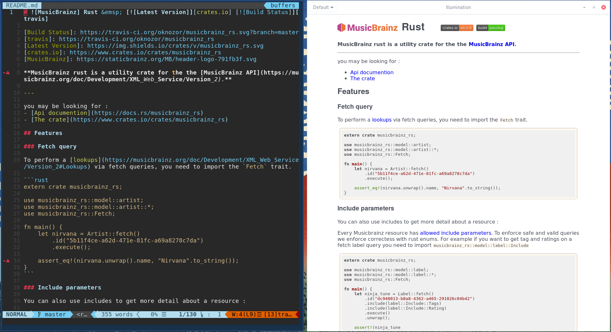

# Nvim Illumination : A lightweight GTK live preview for your notes


---
> An illuminated manuscript is a manuscript in which the text is supplemented with such decoration as initials, borders (marginalia) and miniature illustrations. In the strictest definition, the term refers only to manuscripts decorated with either gold or silver; but in both common usage and modern scholarship, the term refers to any decorated or illustrated manuscript from Western traditions.

From Wikipedia, the free encyclopedia

--- 
Nvim Illumination is a simple Neovim plugin to render buffers in a WebKit2Gtk window. Since it uses the Neovim rpc-api to send buffer updates, ⚠️ **it will not work with vim** ⚠️. 

Note that unlike many note rendering plugins Illumination does not render files, it renders your buffer directly via [nvim rpc api](https://neovim.io/doc/user/api.html), it means you don't need to save the current buffer to render your notes, it is really live!  

Issues and PRs are welcome! 



## Intallation

### Manual installation
---

```sh
git clone  https://github.com/oknozor/illumination/
cd illumination
./install
```

### Using vim-plug

```vim
Plug 'oknozor/illumination', { 'dir': '~/.illumination', 'do': '.install.sh' }
```

## Usage

| Command          | Description                                   |
| ---------------- |:---------------------------------------------:|
| :Illuminate      | Start rendering the current buffer            |
| :IlluminateClose | Close Illumination                            |
| :IlluminateLock  | Toggle lock (won't change active buffer)      |
| :IlluminateOpen  | Render a local file or an URL and toogle lock |

## Debug

To debug Illumination start nvim in RPC mode on port `6666` :

```
nvim test.md --listen 127.0.0.1:6666
```

Then run Illumination without cargo `--release` option. 

```
cd illumination
cargo run 
```
